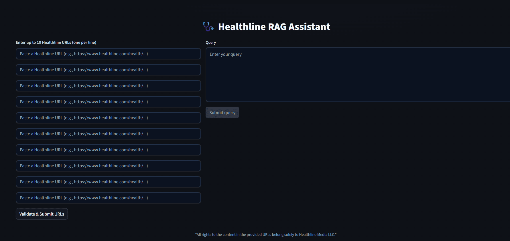

<p align="center">
  
</p>

<h2 align="center">🩺 Healthline RAG Assistant</h2>
<p align="center"><b>A RAG-based chatbot for querying and summarizing health news articles.</b></p>

<p align="center">
  <!-- Core Stack -->
  <a href="https://python.langchain.com/">
    
  </a>
  <a href="https://www.trychroma.com/">
    
  </a>
  <a href="https://groq.com/">
    
  </a>
  <a href="https://ollama.com/">
    
  </a>
  <a href="https://huggingface.co/">
    
  </a>
  <a href="https://streamlit.io/">
    
  </a>
  <a href="https://docs.pytest.org/">
    
  </a>
</p>

<p align="center">
  <!-- Architecture Badges -->
  
  
  
  
</p>

<p align="center">
  <b>LLM Orchestration:</b> LangChain &nbsp; | &nbsp;
  <b>Vector Store:</b> ChromaDB &nbsp; | &nbsp;
  <b>UI:</b> Streamlit
</p>

<p align="center">
  Healthline Assistant uses Retrieval-Augmented Generation (RAG) with vector search to retrieve relevant health news articles and generate grounded, citation-ready responses using modern LLMs.
</p>


---

A fast, grounded, Healthline‑only RAG-based chatbot that builds local embeddings from provided URLs and answers strictly from those sources.

---

## 📖 Description

### 🔹 What it does  
Builds a local vectorstore from user‑selected Healthline articles, then answers questions strictly using content retrieved from those sources.

### 🔹 What problem it solves  
Eliminates manual copy‑paste and unreliable, non‑grounded answers by constraining the model to only the supplied Healthline context.

### 🔹 Motivation  
Inspired by a conversation with a doctor neighbour who found it time‑consuming to manually copy links from Pocket into ChatGPT for summarization; this RAG solution automates ingestion, retrieval, and grounded answering exclusively from Healthline articles.

---

## 🎥 Demo Video

[](artifacts/video_demo.mp4)

---
## 📂 Folder Structure

```bash
Healthcare_Assistant/
├─ core/                     # Backend (ingestion, chunking, embeddings, vectorstore, retrieval, LLM, QA)
│  ├─ __init__.py
│  ├─ config_loader.py       # Loads config.yaml + .env and resolves paths (e.g., persist directory)
│  ├─ loader.py              # Robust URL loader for Healthline content
│  ├─ chunker.py             # Recursive chunk splitter with overlap
│  ├─ embeddings.py          # Embedding factory (HF/SentenceTransformer + trust_remote_code support)
│  ├─ vector_store.py        # Chroma lifecycle (reset persist dir; create store)
│  ├─ indexer.py             # Full rebuild on new URLs; writes collection fingerprint + sources manifest
│  ├─ retrieval.py           # Vectorstore rehydration + general/per-source retrievers
│  ├─ llm.py                 # Chat model factory (Groq or configured LLM)
│  └─ qa.py                  # Strictly grounded QA + per-source summarization (no external citations)
│
├─ frontend/
│  └─ ui_interface.py        # Streamlit UI (dark mode, 10 URL slots, validation, grounded answers)
│
├─ config/
│  ├─ config.yaml            # App configuration (models, chunking, retrieval, paths)
│  └─ .env                   # Secrets and runtime env (e.g., GROQ_API_KEY, EMBEDDING_MODEL)
│
├─ main.py                   # CLI runner: index URLs and ask questions (or summarize per article)
├─ requirements.txt          # Python dependencies
└─ README.md                 # Project documentation
```

---

## ⚙️ Installation Steps

> ⚠️ **Note:** You must create a `.env` file inside the `config/` folder and provide the following variables:  
> - `GROQ_API_KEY`  
> - `CHROMA_DIR`  
> - `GROQ_MODEL`  
> - `EMBEDDING_MODEL`  


```bash
# 1) Python and virtual environment
python -V               # recommend 3.10+
python -m venv .venv
# Windows
.venv\Scripts\activate
# macOS / Linux
source .venv/bin/activate

# 2) Install dependencies
pip install --upgrade pip
pip install -r requirements.txt

# 3) Configure environment (copy and edit as needed)
#   - config/.env must define at least:
#     GROQ_API_KEY=<your_key>
#     EMBEDDING_MODEL="Alibaba-NLP/gte-base-en-v1.5"  # or another supported model
#     # Optional override: CHROMA_DIR=vector_resources/vectorstore

# 4) Verify config
#   - config/config.yaml is present
#   - CHROMA persist directory is resolved under config/ by default
```

**Notes:**  
- The embedding loader supports models that require custom code (`trust_remote_code=True`) and normalizes embeddings for cosine search when appropriate.  
- The vectorstore path is resolved relative to the `config/` folder by default and can be overridden via `CHROMA_DIR` in `.env` (relative paths recommended).  

---

## ▶️ Execution Steps

### CLI (backend only)

```bash
# From the project root
python main.py
```

**Follow prompts:**  
- Paste 1–10 Healthline URLs  
- Wait for indexing: old embeddings are cleared; new ones are built  
- Enter a query (answers are strictly from the indexed sources)  
- To summarize per article: phrase query like *"summarize them separately"*  

### Streamlit UI

```bash
# From the project root
streamlit run frontend/ui_interface.py
```

**In the app:**  
- Paste up to 10 Healthline URLs (fixed rows)  
- Click *"Validate & Submit URLs"* to rebuild embeddings (resets vectorstore)  
- Enter a query and *"Submit query"* for a grounded answer + Healthline source list  

✅ **Behavior guarantees:**  
- *"Validate & Submit URLs"* always clears the existing vectorstore and rebuilds embeddings from scratch.  
- Answers are strictly grounded; if nothing relevant is retrieved, the app returns the exact fallback message.  

---

## 🔎 URL Validation Steps

### Allowed prefixes
- `healthline.com`  
- `www.healthline.com`  
- `https://www.healthline.com`  

### Canonicalization
- Forces `https` scheme and `www.healthline.com` netloc  
- Lowercases the path  
- Removes query/fragment  
- Collapses duplicate slashes  
- Trims trailing slash (except root)  

### Deduplication
Detects duplicates across formats using canonical form (e.g., `healthline.com/...`, `www.healthline.com/...`, and `https://www.healthline.com/...` all resolve to one).

### Limits
- 1–10 URLs per session; empty rows are ignored.  
- Only validated, canonical Healthline URLs proceed to loading and embedding.  

---

## 🛠️ Technologies Used

- ✅ Python 3.10+  
- ✅ Streamlit (frontend UI)  
- ✅ LangChain (chains, prompts, retrievers)  
- ✅ ChromaDB (local vectorstore persistence)  
- ✅ Sentence-Transformers / Hugging Face (embeddings, trust_remote_code support)  
- ✅ Groq (LLM API integration) — can also run locally via Ollama  
- ✅ Unstructured URL loader (robust web article parsing)  
- ✅ python-dotenv, PyYAML (config/env management)  

---

## 🚀 Roadmap & Future Updates

- 📜 **Detailed module‑wise logs**: Structured logging for ingestion, chunking, embedding, retrieval, and answering to simplify audits and error tracing.  
- 🔗 **Pocket integration**: One‑click import of saved Healthline links from Pocket.  
- ☁️ **Cloud deployment**: Dockerize and deploy on a managed platform.  
- 🧪 **Model experiments**: Test other embeddings and LLMs for groundedness and evaluate multi‑query retrieval for complex questions.  

---

## 🙏 Credits and Acknowledgements

- Healthline articles for high‑quality, clinician‑reviewed content used as the knowledge base.  
- Open‑source maintainers across the LangChain, ChromaDB, Hugging Face, Streamlit, and Sentence‑Transformers ecosystems.  

---

## ⚠️ Disclaimer

“All rights to the content in the provided URLs belong solely to Healthline Media LLC.”  

---

## 📌 Quick Tips

- Re‑indexing resets prior embeddings; keep distinct sessions per topic for focused retrieval.  
- Use precise, article‑aligned queries; for multi‑article tasks, the system can summarize each article separately.  
- If a fact isn’t in the supplied Healthline sources, the assistant will return the exact fallback rather than hallucinate.  
---

*Expect a RAG-powered, assumption-averse approach to answers.*